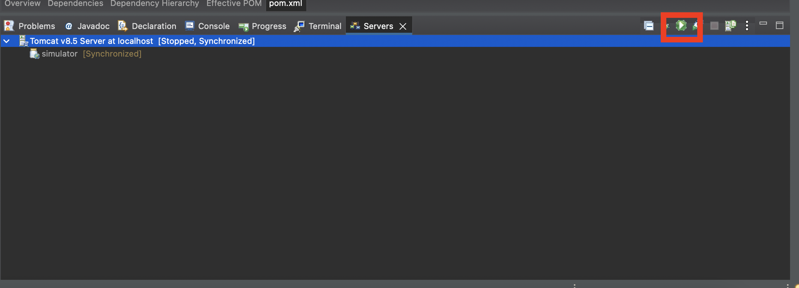

# Simulateur java

# Pré-requis

## Ouitls

1. **Open JDK 8**
2. **Eclipse IDE for Java EE Developers**
3. **Apache Tomcat 10**

## Téléchargements

### Open JDK 8

> **Windows x86 64-bit**
> 

[](https://builds.openlogic.com/downloadJDK/openlogic-openjdk-jre/8u262-b10/openlogic-openjdk-jre-8u262-b10-windows-x64.msi)

> **Linux x86 64-bit**
> 

[](https://builds.openlogic.com/downloadJDK/openlogic-openjdk-jre/8u262-b10/openlogic-openjdk-jre-8u262-b10-linux-x64.tar.gz)

> **MacOS x86 64-bit**
> 

[](https://builds.openlogic.com/downloadJDK/openlogic-openjdk-jre/8u262-b10/openlogic-openjdk-jre-8u262-b10-mac-x64.pkg)

### Eclipse IDE for Java EE Developers

> **En fonction de votre plateforme**
> 

[Eclipse downloads - Select a mirror | The Eclipse Foundation](https://www.eclipse.org/downloads/download.php?file=/oomph/epp/2021-12/R/eclipse-inst-jre-mac64.dmg)

### **Apache Tomcat 8.5**

> **Windows 64-bit**
> 

[](https://dlcdn.apache.org/tomcat/tomcat-8/v8.5.73/bin/apache-tomcat-8.5.73-windows-x64.zip)

> **Linux & MacOS**
> 

[](https://dlcdn.apache.org/tomcat/tomcat-8/v8.5.73/bin/apache-tomcat-8.5.73.zip)

## Tutoriel à suivre

[https://www.youtube.com/watch?v=lw7ppSSha8c](https://www.youtube.com/watch?v=lw7ppSSha8c)

# Configuration

## Eclipse

1. Ouvrir le projet :
    
    [https://www.notion.so](https://www.notion.so)
    
2. Clique droit sur le projet dans votre arborescence → **`Properties → Java Build Path`**
    1. Supprimer JRE si ≠ 1.8 → Bouton **`remove`**
    2. **`Add Library → JRE System Library → Next → Execution environment → JavaSE-1.8 (Java) → Installed JREs`**
    3. Double cliques sur le premier → **`Directory`** → Spécifier le chemin du JDK8 précédemment téléchargé
        
        <aside>
        🚧 Sous MacOS : /Library/Java/JavaVirtualMachines/openlogic-openjdk-8.jdk/Contents/Home
        
        </aside>
        
    4. **`Apply and Close → Finish → Apply and Close`**
3. **Vous devriez ne plus avoir de warnings**

1. Clique droit sur le projet dans votre arborescence → **`Properties → Project Facets`** → Si besoin cliquer sur la proposition de "**`Convert`** ..."
2. Sur **`Java`** indiquer **`1.8`**

1. **`Help → Install New Software... -> Work with -> All Available Sites`**
2. Rechercher **`Server → Web, Xml, Java EE and OSGi Enterprise Development`**
3. Installer tout et relancer Eclipse
4. **`Window → Show View → Other... → Server → Servers`**
5. Cliquer sur **`No servers are available. Click this link to create a new server...`**
6. **`Apache → Tomcat v8.5 Server → Next → Browse`** → Indiquer le chemin de Tomcat 8.5 précédemment téléchargé

```
Description Resource Path Location Type Classpath entry org.eclipse.m2e.MAVEN2_CLASSPATH_CONTAINER will not be exported or published.
```

Il faut changer ceci :

```
<classpathentry exported="true" kind="con" path="org.eclipse.m2e.MAVEN2_CLASSPATH_CONTAINER">
	<attributes>
		<attribute name="maven.pomderived" value="true"/>
	</attributes>
</classpathentry>
```

Par ceci :

```
<classpathentry exported="true" kind="con" path="org.eclipse.m2e.MAVEN2_CLASSPATH_CONTAINER">
	<attributes>
		<attribute name="maven.pomderived" value="true"/>
		<attribute name="org.eclipse.jst.component.nondependency" value=""/>
	</attributes>
</classpathentry>
```

# Lancer l'application

## Lancer le serveur Tom cat :



## Lien de l'application

```
http://localhost:8080/simulator/index.jsp
```

# Build

1. **`Clique droit application → Run As → Maven build`**
2. **`Goals : package`**
3. **`Run`**
4. **`Clique droit application → Refresh`**
5. Dans le dossier target il y a le fichier .war à déployer sur un serveur final tomcat